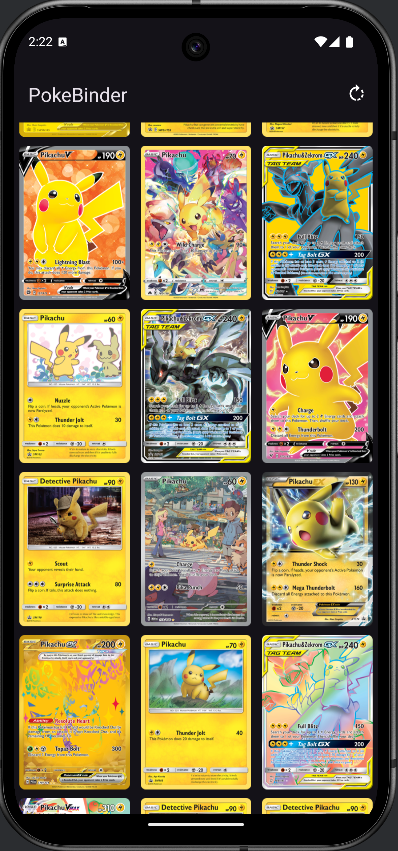

# PokeBinder

PokeBinder is an application built on AndroidStudio that grabs pokemon card sets from a locally hosted database that contains all sets of English 
pokemon cards as well as a "Gigadex" which is an unofficial set of Pokemon cards containing one of every pokemon. This application allows users
to keep track of which cards they have, their prices, what cards they still need and which cards they are specifically looking for.

## Features

*   Set Selection: Displays every currently released set + a "Gigadex" set for users to quickly and easily choose the sets they want to update.

    

*   Gigadex: A set containing one of every Pokemon, cards you own will display, cards you dont will show the back of a card. Clicking on a card will
display every currently released card of that Pokemon allowing the user to choose their owned card.

    

        
        
    

*   Search: When in vertical mode in the binder, you can search for certain Pokemon using the searchbar at the top, which filters which Pokemon are shown.

    

*   Set Select: For sets that aren't the Gigadex, gray Pokeballs will appear on the bottom of the card, the user clicks on this when they own the card
which turns it red and saves that the user owns these cards in the database.

    

*   Card Info: When the image of the card is pressed, it opens a larger image with some card information which includes its name and price.
  

    

